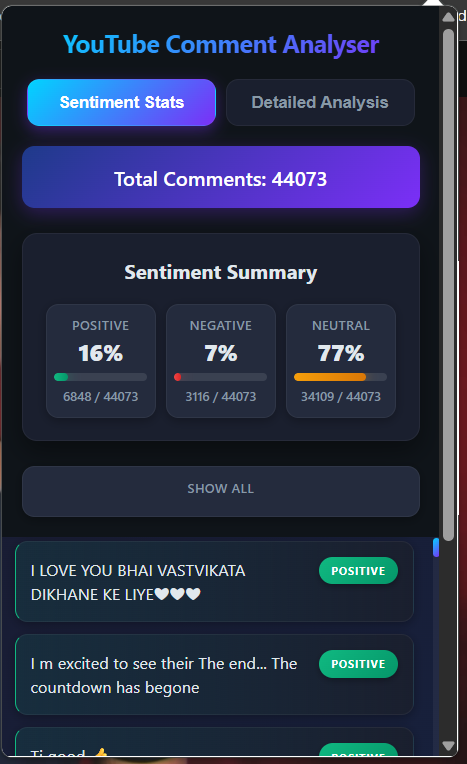
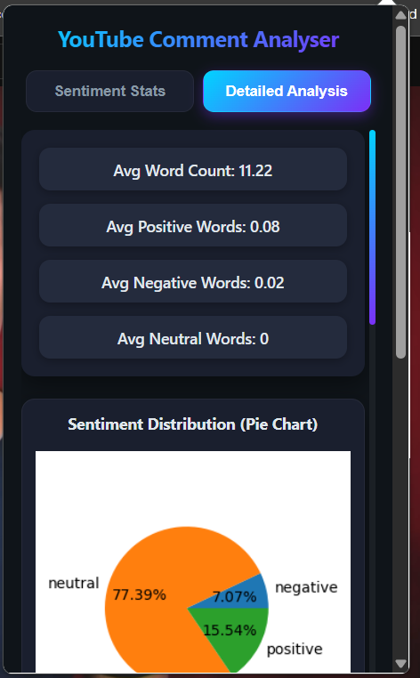
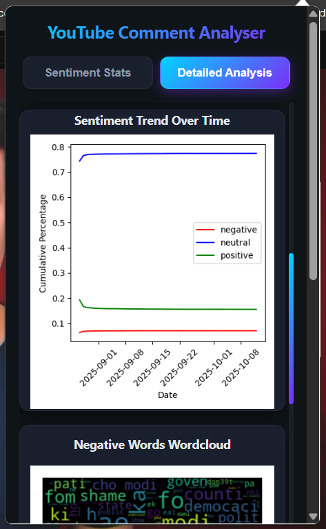
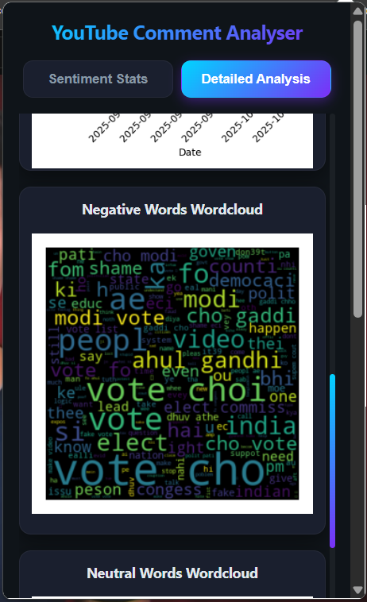

# YouTube Comment Analysis Plugin

A powerful AI-based tool that fetches comments from YouTube videos and performs **detailed sentiment and behavior analysis** — deployed using **Kubernetes** for scalability and robustness.

---

##  Overview

This project is designed to analyze user sentiments and engagement patterns from YouTube video comments.  
It leverages **machine learning** and **natural language processing (NLP)** techniques to classify comments into categories like **positive**, **negative**, or **neutral**, and generate insightful visualizations.

Despite dealing with **highly imbalanced data**, the model achieves an impressive **accuracy of 0.87**.

---

## Key Features

-  **Automatic comment extraction** from any YouTube video  
-  **ML-powered sentiment classification** with high precision  
-  **Comprehensive analytics dashboard** for insights and trends  
-  **Deployed on Kubernetes** for seamless scalability  
-  **Modular architecture** for easy integration and extension  

---

## Tech Stack

| Category | Tools / Technologies |
|-----------|----------------------|
| **Backend** | Python, FastAPI |
| **Frontend** | HTML, CSS, JS (Vibe coded) |
| **EDA** | Pandas ,Numpy ,Plotly , Matplotlib , Seaborn |
| **ML / NLP** | TensorFlow ( ANN ,RNN ,Embeddings ) , scikit-learn , XGBoost ,LightGBM |
| **Pipeline** | DVC , Scikit-learn |
| **Experiment Tracking** | MLFLOW ( hosted on EC2 , S3) |
| **Version Control** | GitHub, DVC |
| **Deployment** | Docker, Kubernetes, AWS ( ECR,EC2,S3 )|

---

## How It Works

1. **Input:** YouTube video URL  
2. **Fetch:** The plugin uses YouTube Data API to fetch all public comments  
3. **Preprocess:** Clean and tokenize text  
4. **Predict:** Run comments through the trained ML model  
5. **Visualize:** Generate sentiment distribution and keyword trends  

---

## 📸 Demo


| Example | Description |
|----------|--------------|
|  | Dashboard showing sentiment distribution |
|  | Pie Chart |
|  | Trend chart |
|  | Wordcloud |

---

##  Model Report

**Model:** `best_model_ann`\
**Version:** `4`
***

### 1. Performance Metrics

| Metric | Negative | Neutral | Positive |
|--------|--------|--------|--------|
| Precision | 0.922 | 0.733 | 0.943 |
| Recall    | 0.868 | 0.873 | 0.881 |
| F1-score  | 0.894 | 0.797 | 0.911 |

**Overall Accuracy:** 0.877

**ROC-AUC (OvR):**

*   Negative: 0.974
*   Neutral: 0.943
*   Positive: 0.957

***

### 2. Confusion Matrix


***

## 3. ROC Curve


***

##  Installation & Usage

```bash
# Clone this repository
git clone https://github.com/pankaj-2708/You-tube-Comment-analysis.git
cd Youtube Comment analysis

# Install dependencies
pip install -r requirements.txt

# Run locally
python backend.py
```

Then open your browser at **http://localhost:8000/** to start analyzing comments.

---

## Author

**Pankaj Maulekhi**  
*B.Tech AI & Data Science @ IIITDM Kurnool*  
🌐 [GitHub](https://github.com/pankaj-2708)


---

---

### 🌟 Support

If you like this project, please give it a ⭐ on GitHub — it helps a lot!

<a target="_blank" href="https://cookiecutter-data-science.drivendata.org/">
    
</a>

## Project Organization

```
├── .dvc
    ├── .gitignore
    └── config
├── .dvcignore
├── .github
    └── workflows
    │   └── ci_cd.yml
├── .gitignore
├── Makefile
├── README.md
├── catboost_info
    ├── catboost_training.json
    ├── learn
    │   └── events.out.tfevents
    ├── learn_error.tsv
    ├── time_left.tsv
    └── tmp
    │   └── cat_feature_index.6787178b-6bd2bcac-e5c9907b-4cea70a6.tmp
├── docs
    └── .gitkeep
├── dvc.lock
├── dvc.yaml
├── mlruns
    ├── 0
    │   └── meta.yaml
    └── 621943523215326986
    │   └── meta.yaml
├── models
    └── .gitkeep
├── notebooks
    ├── .gitkeep
    ├── 0_preprocessing_and_EDA.ipynb
    ├── 1_vectorisation.ipynb
    ├── 2_ml.ipynb
    └── 3_dl.ipynb
├── params.yaml
├── pyproject.toml
├── references
    └── .gitkeep
├── requirements.txt
├── setup.cfg
└── src
    ├── Webapp
        ├── Backend
        │   ├── Dockerfile
        │   ├── backend.py
        │   ├── backend_utility.py
        │   ├── images
        │   │   ├── negative.png
        │   │   ├── neutral.png
        │   │   ├── pie.png
        │   │   ├── positive.png
        │   │   └── trend.png
        │   └── requirements.txt
        └── Frontend
        │   ├── manifest.json
        │   ├── popup.css
        │   ├── popup.html
        │   └── popup.js
    └── dvc_pipeline
        ├── 0_preprocess.py
        ├── 1_vetorisation.py
        ├── 2_imb_handling.py
        ├── 3_model.py
        ├── 4_dl.py
        ├── 5_register_model.py
        ├── 6_model_report.py
        └── requirements.txt