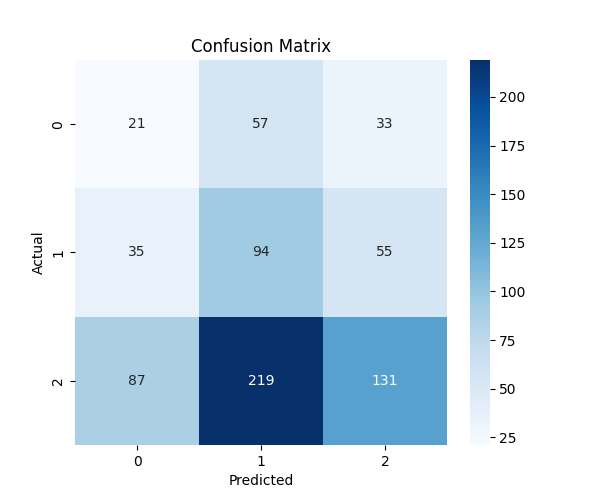
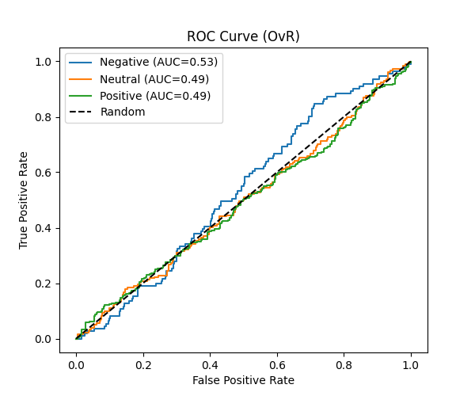

# Model Evaluation Report

**Model:** `best_model_ann`  
**Version:** `2`  

---

## 1. Overview
This report evaluates the model performance on the test dataset. Metrics, confusion matrix, and ROC curves are provided for multiclass sentiment prediction.

---

## 2. Performance Metrics

| Metric | Negative | Neutral | Positive |
|--------|--------|--------|--------|
| Precision | 0.147 | 0.254 | 0.598 |
| Recall    | 0.189 | 0.511 | 0.300 |
| F1-score  | 0.165 | 0.339 | 0.399 |

**Overall Accuracy:** 0.336  

**ROC-AUC (OvR):**  
- Negative: 0.530
- Neutral: 0.492
- Positive: 0.488

---

## 3. Confusion Matrix

---

## 4. ROC Curve

---
